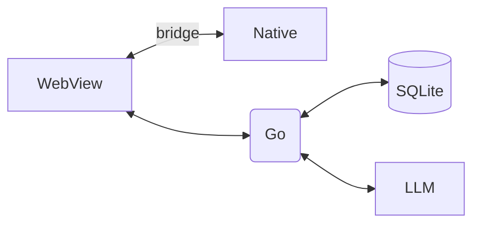

# アーキテクチャ

## 非機能要件（プロトタイプ）

- **起動時間**: 初回 3s 以内目標（WebView 初期ロード含む）
- **オフライン**: 完全ローカルで動作。ネット断でも機能継続
- **セキュリティ/プライバシ**: 端末内 SQLite/IndexedDB に保存。通信は `localhost` のみ
- **ログ**: デバッグ用操作ログ（PII は不可）
- **アクセシビリティ**: キーボード操作可能、コントラスト比 4.5:1 以上、ダイナミックタイプ対応

## アーキテクチャ概要

- **フロント（WebView）**: React + React Router。**SSG（静的サイト生成）**で全ルートをプリレンダし、起動時にローカルから配信しハイドレーション。ルーティングはクライアント側で完結。
- **ネイティブブリッジ**: `bridge.captureScreenshot()`, `bridge.getAppInfo()`, `bridge.requestPermission('capture')`
- **ローカルサーバ（バックエンド）**: **Go** 製（例: net/http + chi / gin）。REST + WebSocket。データ永続化（SQLite）
- **LLM サービス**: `/llm/chat`（ストリーム応答対応）

### クライアント技術スタック

- **Linux (Ubuntu)**: ネイティブ層は **Rust**（screenshot/権限/トレイ/タイマー）
- **Windows**: **C++**（Win32/COM、Graphics Capture API）
- **iPad/iPhone**: **Swift**（ReplayKit / UIScreenCapture API）
- **Mac**: **Swift**（ScreenCaptureKit / AVFoundation）

## システム構成図

## レイヤ構成

### プレゼンテーション層（WebView）

- React コンポーネント
- React Router によるクライアントサイドルーティング
- SSG による高速初回ロード
- 状態管理（Redux/Zustand 等）

### ネイティブ層

- OS固有のキャプチャAPI実装
- WebView との JavaScript ブリッジ
- 権限管理
- システムトレイ/通知

### アプリケーション層（Go サーバ）

- HTTP/WebSocket ハンドラ
- ビジネスロジック
- LLM との通信
- スケジューラ（定期キャプチャ）

### データ層

- SQLite によるローカル永続化
- マイグレーション管理
- トランザクション制御

## セキュリティ考慮事項

- 全データは端末内に保存
- 通信は localhost のみ（外部ネットワーク不要）
- スクリーンショットはユーザー指定ディレクトリに保存
- 権限は OS 標準の仕組みに従う
- PII（個人識別情報）はログに含めない

## パフォーマンス

- 起動時間目標: 3秒以内
- SSG による HTML/CSS/JS の事前ビルド
- WebSocket によるリアルタイム通信
- SQLite によるローカル高速アクセス
- サムネイル生成による画像一覧の高速化

