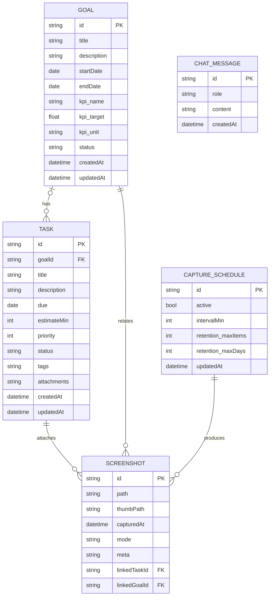

# データモデル

## 概要

データは全て SQLite に保存される。主要テーブルは以下の通り：

- `goals` - 目標
- `tasks` - タスク
- `screenshots` - スクリーンショット（内部）
- `capture_schedules` - キャプチャスケジュール
- `chat_messages` - チャット履歴

## ER 図



## テーブル定義詳細

### GOAL（目標）

| カラム名    | 型       | 説明                             |
| ----------- | -------- | -------------------------------- |
| id          | string   | 主キー（UUID）                   |
| title       | string   | 目標タイトル                     |
| description | string   | 詳細説明                         |
| startDate   | date     | 開始日                           |
| endDate     | date     | 終了日                           |
| kpi_name    | string   | KPI 名称（例: "集中作業時間"）   |
| kpi_target  | float    | KPI 目標値                       |
| kpi_unit    | string   | KPI 単位（例: "時間"）           |
| status      | string   | ステータス（active/paused/done） |
| createdAt   | datetime | 作成日時                         |
| updatedAt   | datetime | 更新日時                         |

### TASK（タスク）

| カラム名    | 型       | 説明                                          |
| ----------- | -------- | --------------------------------------------- |
| id          | string   | 主キー（UUID）                                |
| goalId      | string   | 関連目標 ID（外部キー、NULL 可）              |
| title       | string   | タスクタイトル                                |
| description | string   | 詳細説明                                      |
| due         | date     | 期日                                          |
| estimateMin | int      | 推定所要時間（分）                            |
| priority    | int      | 優先度（1-5）                                 |
| status      | string   | ステータス（todo/doing/paused/done/archived） |
| tags        | string   | タグ（JSON 配列文字列）                       |
| attachments | string   | 添付ファイル情報（JSON 配列文字列）           |
| createdAt   | datetime | 作成日時                                      |
| updatedAt   | datetime | 更新日時                                      |

### SCREENSHOT（スクリーンショット）

| カラム名     | 型       | 説明                               |
| ------------ | -------- | ---------------------------------- |
| id           | string   | 主キー（UUID）                     |
| path         | string   | ファイルパス                       |
| thumbPath    | string   | サムネイルパス                     |
| capturedAt   | datetime | 撮影日時                           |
| mode         | string   | モード（manual/scheduled）         |
| meta         | string   | メタデータ（JSON 文字列）          |
| linkedTaskId | string   | 関連タスク ID（外部キー、NULL 可） |
| linkedGoalId | string   | 関連目標 ID（外部キー、NULL 可）   |

### CAPTURE_SCHEDULE（キャプチャスケジュール）

| カラム名           | 型       | 説明             |
| ------------------ | -------- | ---------------- |
| id                 | string   | 主キー（UUID）   |
| active             | bool     | 有効/無効        |
| intervalMin        | int      | 実行間隔（分）   |
| retention_maxItems | int      | 保存上限（件数） |
| retention_maxDays  | int      | 保存上限（日数） |
| updatedAt          | datetime | 更新日時         |

### CHAT_MESSAGE（チャット履歴）

| カラム名  | 型       | 説明                            |
| --------- | -------- | ------------------------------- |
| id        | string   | 主キー（UUID）                  |
| role      | string   | ロール（user/assistant/system） |
| content   | string   | メッセージ内容                  |
| createdAt | datetime | 作成日時                        |

## 型定義（TypeScript 例）

```ts
// 主要テーブル: goals, tasks, screenshots(内部), capture_schedules, chat_messages

interface Goal {
  id: string;
  title: string;
  description: string;
  startDate: string; // ISO date
  endDate: string;
  kpi_name: string;
  kpi_target: number;
  kpi_unit: string;
  status: "active" | "paused" | "done";
  createdAt: string; // ISO datetime
  updatedAt: string;
}

interface Task {
  id: string;
  goalId?: string;
  title: string;
  description: string;
  due: string; // ISO date
  estimateMin: number;
  priority: number; // 1-5
  status: "todo" | "doing" | "paused" | "done" | "archived";
  tags: string[]; // stored as JSON
  attachments: string[]; // stored as JSON
  createdAt: string;
  updatedAt: string;
}

interface Screenshot {
  id: string;
  path: string;
  thumbPath?: string;
  capturedAt: string;
  mode: "manual" | "scheduled";
  meta: Record<string, any>; // stored as JSON
  linkedTaskId?: string;
  linkedGoalId?: string;
}

interface CaptureSchedule {
  id: string;
  active: boolean;
  intervalMin: number;
  retention_maxItems: number;
  retention_maxDays: number;
  updatedAt: string;
}

interface ChatMessage {
  id: string;
  role: "user" | "assistant" | "system";
  content: string;
  createdAt: string;
}
```

## インデックス

- `goals.status` - ステータスフィルタ用
- `tasks.status` - ステータスフィルタ用
- `tasks.due` - 期日ソート用
- `tasks.goalId` - 目標別タスク一覧用
- `screenshots.capturedAt` - 時系列表示用
- `screenshots.linkedTaskId` - タスク別スクリーンショット用
- `chat_messages.createdAt` - 時系列表示用

## マイグレーション戦略

- Go の migration ツール（golang-migrate 等）を使用
- バージョン管理された SQL ファイル（up/down）
- アプリ起動時に自動実行
