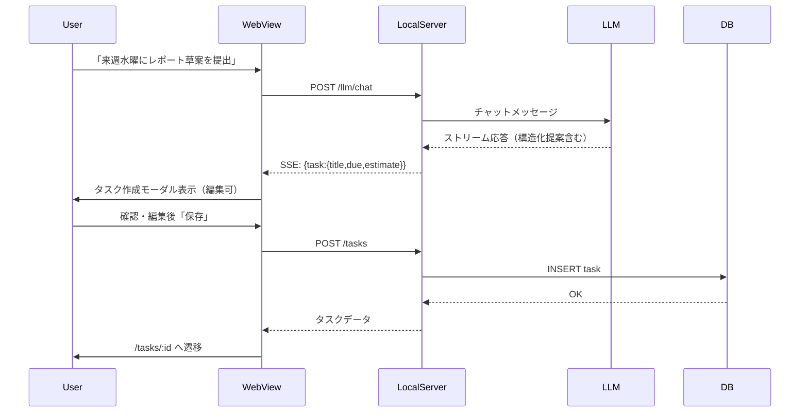
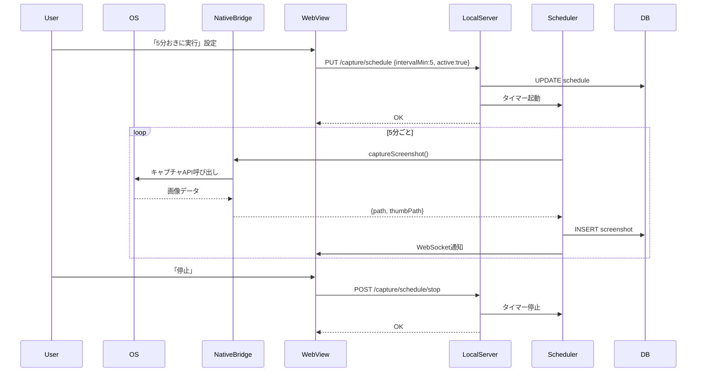
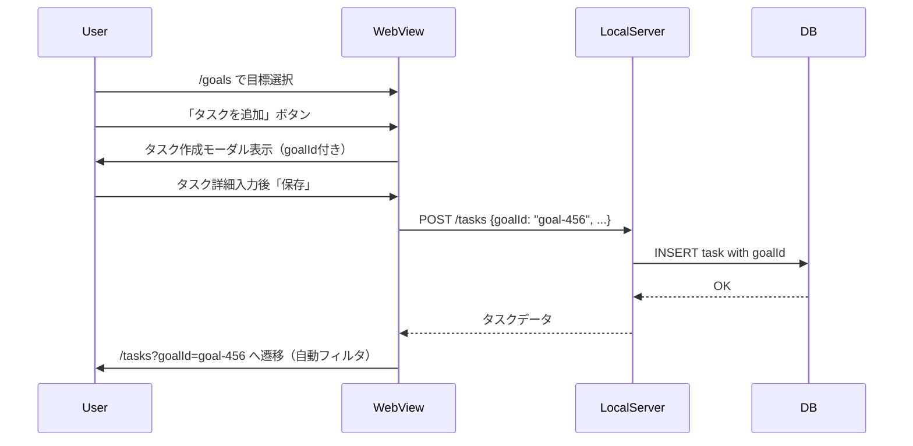
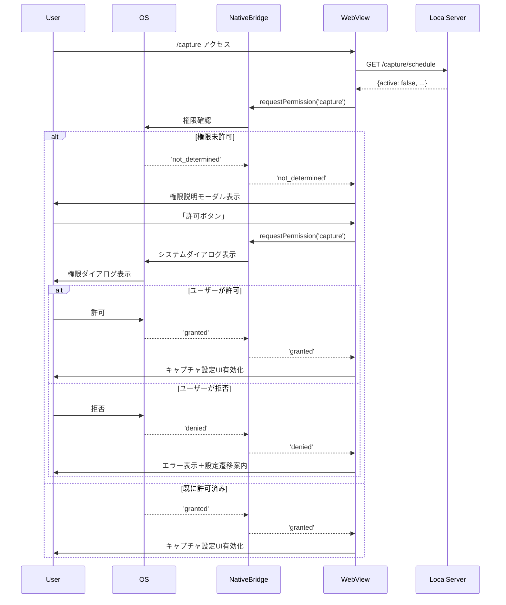
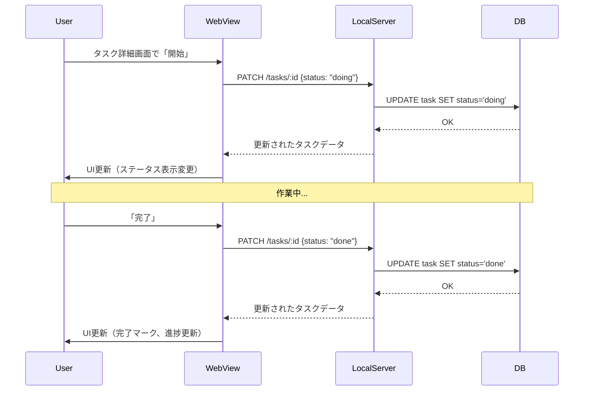
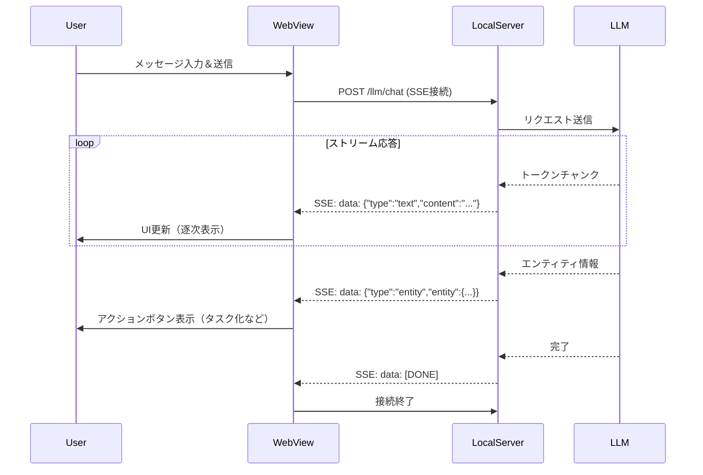
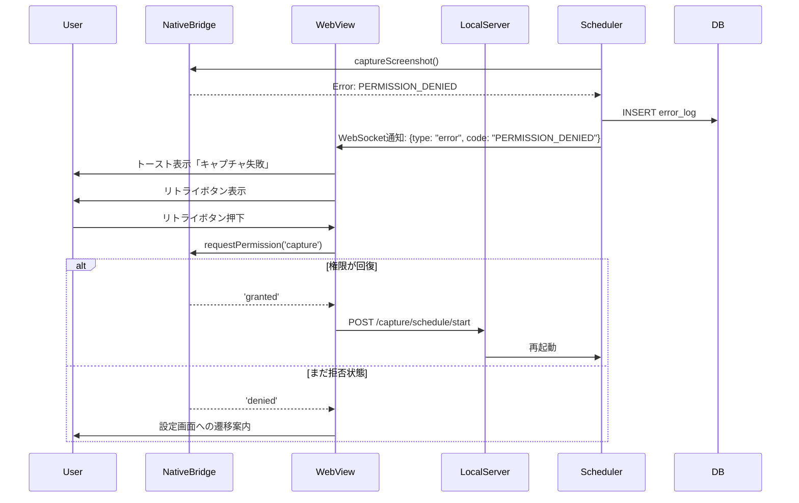

# 主要フロー

システムの主要な処理フローをシーケンスで示す。

## チャットからタスク作成

ユーザーがチャットでタスクの相談をし、LLMが提案したタスクを作成する流れ。

### 処理ステップ

1. User→Chat: 「来週水曜にレポート草案を…」
2. LLM→Front: 構造化提案 `{task:{title,due,estimate}}`
3. Front: タスク作成モーダルを起動（編集可）
4. API: `POST /tasks` → 保存 → 画面遷移 `/tasks/:id`

## 定期キャプチャの開始/停止

定期キャプチャのスケジュール設定と実行の流れ。

### 処理ステップ

1. User→Capture: 「5分おきに実行」→ `PUT /capture/schedule {intervalMin:5, active:true}`
2. Server: スケジューラ起動（Go でタイマー）
3. Server→NativeBridge: 間隔ごとに `captureScreenshot()`
4. User→Capture: 「停止」→ `POST /capture/schedule/stop`

## 目標→タスク化

既存の目標からタスクを作成する流れ。

### 処理ステップ

1. `/goals` で目標選択→「タスクを追加」
2. `POST /tasks` goalId 指定
3. タスク一覧で目標フィルタを自動適用

## 権限取得フロー

画面キャプチャ権限を取得する流れ。

## タスク状態変更フロー

タスクのステータスを変更する流れ。

## チャットストリーミング

LLMとのリアルタイムチャット通信。

## エラー処理フロー

キャプチャ失敗時のリトライ処理。

