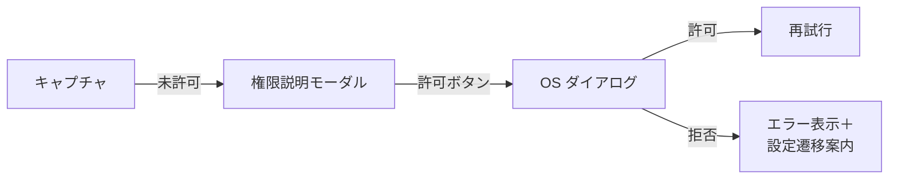

# プラットフォーム固有実装

各OSにおけるキャプチャ実装と権限管理の詳細。

## macOS (Swift)

### 使用技術

- **ScreenCaptureKit** (macOS 12.3+) - 高性能な画面収録API
- **AVFoundation** (フォールバック用)

### 権限管理

- **画面収録権限**が必要
- 初回アクセス時にシステムダイアログが表示される
- 権限が未許可の場合、システム設定（システム環境設定 → プライバシーとセキュリティ → 画面収録）への誘導が必要
- **許可後、アプリの再起動が必要な場合がある**

### 実装例

```swift
import ScreenCaptureKit

func checkCapturePermission() async -> Bool {
    if #available(macOS 12.3, *) {
        do {
            let content = try await SCShareableContent.current
            return !content.displays.isEmpty
        } catch {
            return false
        }
    }
    return false
}

func captureScreen() async throws -> Data {
    guard #available(macOS 12.3, *) else {
        throw CaptureError.unsupportedOS
    }
    
    let content = try await SCShareableContent.current
    guard let display = content.displays.first else {
        throw CaptureError.noDisplay
    }
    
    let filter = SCContentFilter(display: display, excludingWindows: [])
    let config = SCStreamConfiguration()
    
    // キャプチャ実行
    let image = try await SCScreenshotManager.captureImage(
        contentFilter: filter,
        configuration: config
    )
    
    return image.tiffRepresentation!
}
```

### 注意事項

- 複数ディスプレイ対応が必要
- ウィンドウ除外機能の実装
- CPU/バッテリ配慮（解像度調整）

## Windows (C++)

### 使用技術

- **Windows.Graphics.Capture API** (Windows 10 1903+)
- **DXGI Desktop Duplication API** (フォールバック用)

### 権限管理

- **UAC権限は不要**（通常ユーザーで実行可能）
- ただし、管理者権限で実行中のウィンドウは取得できない制約あり
- 初回使用時に Windows セキュリティの通知が出る場合がある

### 実装例

```cpp
#include <winrt/Windows.Graphics.Capture.h>
#include <winrt/Windows.Graphics.DirectX.Direct3D11.h>

using namespace winrt;
using namespace Windows::Graphics::Capture;
using namespace Windows::Graphics::DirectX::Direct3D11;

// モニタ選択UI表示
auto picker = GraphicsCapturePicker();
auto item = co_await picker.PickSingleItemAsync();

if (item) {
    // キャプチャセッション作成
    auto framePool = Direct3D11CaptureFramePool::Create(
        device,
        DirectXPixelFormat::B8G8R8A8UIntNormalized,
        2,
        item.Size()
    );
    
    auto session = framePool.CreateCaptureSession(item);
    
    // フレーム取得ハンドラ
    framePool.FrameArrived([](auto& sender, auto& args) {
        auto frame = sender.TryGetNextFrame();
        // frame を画像として保存
    });
    
    session.StartCapture();
}
```

### 注意事項

- **複数モニタ選択UIが必要**（GraphicsCapturePicker）
- DPI スケーリング対応
- HDR モニタ対応

## Linux/Ubuntu (Rust)

### 使用技術

- **X11**: `xlib` / `xcb` でスクリーンショット取得
- **Wayland**: **XDG Desktop Portal** 経由（`org.freedesktop.portal.Screenshot`）

### 権限管理

- **X11**: 権限不要（X サーバーに接続できれば取得可能）
- **Wayland**: ポータル経由で動的に許可を求める
  - システムダイアログが表示される
  - Flatpak/Snap 環境でも動作

### 実装例（Wayland Portal）

```rust
use zbus::{Connection, dbus_proxy};

#[dbus_proxy(
    interface = "org.freedesktop.portal.Screenshot",
    default_service = "org.freedesktop.portal.Desktop",
    default_path = "/org/freedesktop/portal/desktop"
)]
trait Screenshot {
    fn screenshot(
        &self,
        parent_window: &str,
        options: std::collections::HashMap<&str, zbus::zvariant::Value>
    ) -> zbus::Result<zbus::zvariant::OwnedObjectPath>;
}

async fn capture_wayland() -> Result<String, Box<dyn std::error::Error>> {
    let connection = Connection::session().await?;
    let proxy = ScreenshotProxy::new(&connection).await?;
    
    let mut options = std::collections::HashMap::new();
    options.insert("interactive", zbus::zvariant::Value::new(false));
    
    let handle = proxy.screenshot("", options).await?;
    
    // handle から URI を取得して画像保存
    Ok("/path/to/screenshot.png".to_string())
}
```

### 実装例（X11）

```rust
use x11rb::connection::Connection;
use x11rb::protocol::xproto::*;

fn capture_x11() -> Result<Vec<u8>, Box<dyn std::error::Error>> {
    let (conn, screen_num) = x11rb::connect(None)?;
    let screen = &conn.setup().roots[screen_num];
    
    let geometry = conn.get_geometry(screen.root)?.reply()?;
    
    let image = conn.get_image(
        ImageFormat::Z_PIXMAP,
        screen.root,
        0, 0,
        geometry.width,
        geometry.height,
        !0
    )?.reply()?;
    
    Ok(image.data)
}
```

### 注意事項

- **Wayland/X11 両対応が必須**
- 環境変数 `XDG_SESSION_TYPE` で判定
- Wayland では領域選択 UI を Rust で実装
- 複数モニタ対応（xrandr/wlr-randr）

## iOS/iPadOS (Swift)

### 使用技術

- **ReplayKit** (`RPScreenRecorder`) - 画面収録
- **UIGraphicsImageRenderer** - アプリ内ビュー限定

### 権限管理

- **システム全体のスクリーンショットは制限されている**
- アプリ内ビューのキャプチャは権限不要
- 全画面録画は ReplayKit を使用（ユーザーが明示的に開始）

### 実装例（アプリ内ビュー）

```swift
import UIKit

func captureView(_ view: UIView) -> UIImage? {
    let renderer = UIGraphicsImageRenderer(bounds: view.bounds)
    return renderer.image { context in
        view.layer.render(in: context.cgContext)
    }
}
```

### 実装例（ReplayKit）

```swift
import ReplayKit

func startRecording() {
    let recorder = RPScreenRecorder.shared()
    
    recorder.startRecording { error in
        if let error = error {
            print("録画開始エラー: \(error)")
        }
    }
}

func stopRecording() {
    let recorder = RPScreenRecorder.shared()
    
    recorder.stopRecording { previewController, error in
        if let error = error {
            print("録画停止エラー: \(error)")
        }
        // プレビューコントローラを表示
    }
}
```

### 注意事項

- **OS 制約上、システム全体のキャプチャは実質不可**
- **アプリ内ビュー限定キャプチャを標準とする**
- 画面録画/共有拡張を併用する選択肢もある
- iPadOS では複数ウィンドウ（Split View）対応が必要

## 権限取得フロー（共通）



## プラットフォーム別機能対応表

| 機能                     | macOS | Windows | Linux (X11) | Linux (Wayland) | iOS/iPadOS |
| ------------------------ | ----- | ------- | ----------- | --------------- | ---------- |
| 全画面キャプチャ         | ✅    | ✅      | ✅          | ✅              | ❌         |
| ウィンドウキャプチャ     | ✅    | ✅      | ✅          | ✅              | ❌         |
| 領域選択キャプチャ       | ✅    | ✅      | ✅          | ✅              | ❌         |
| アプリ内ビューキャプチャ | ✅    | ✅      | ✅          | ✅              | ✅         |
| 複数モニタ対応           | ✅    | ✅      | ✅          | ✅              | N/A        |
| 除外ウィンドウ           | ✅    | ✅      | ⚠️          | ⚠️              | N/A        |
| HDR サポート             | ✅    | ✅      | ❌          | ❌              | ✅         |

✅ フルサポート / ⚠️ 部分的サポート / ❌ 非サポート / N/A 該当なし

## パフォーマンス考慮事項

### 全プラットフォーム共通

- キャプチャ解像度の調整（設定可能）
- サムネイル生成の並列化
- ディスクI/O の非同期化
- ジッター（ランダム遅延）によるCPU負荷分散

### プラットフォーム別

- **macOS**: Metal を利用した高速画像処理
- **Windows**: Direct3D11 による GPU 加速
- **Linux**: 複数のバックエンド（libpng, libjpeg-turbo）
- **iOS**: UIImage の圧縮品質調整

