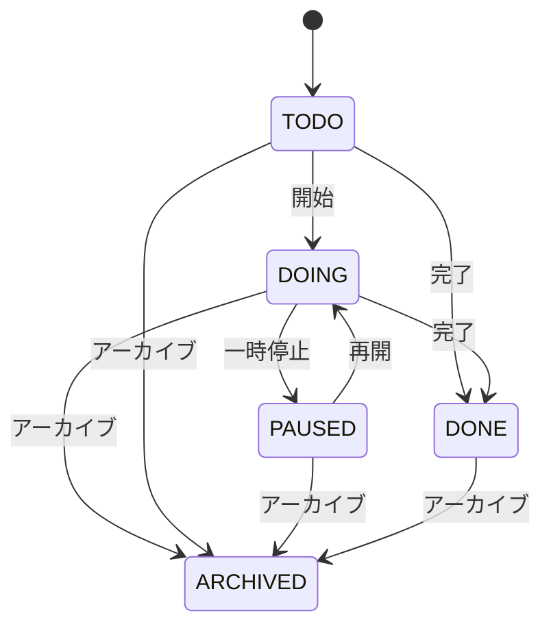
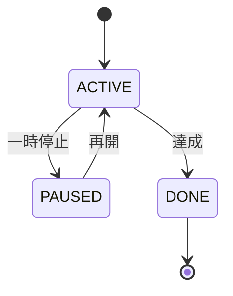
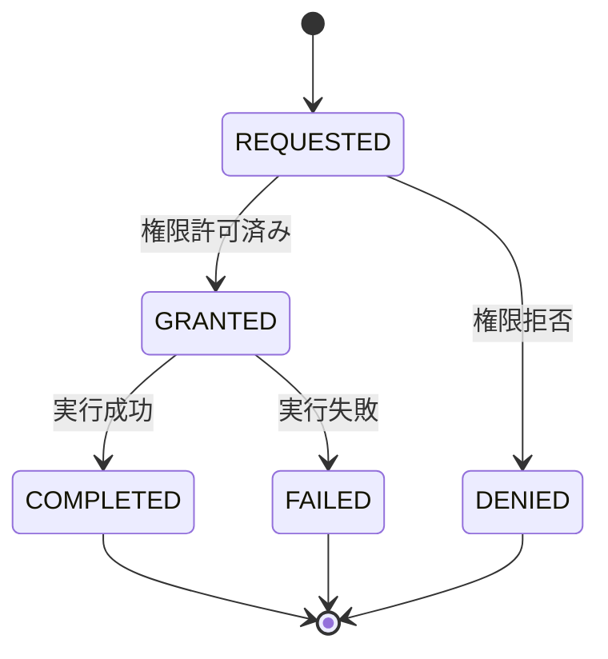
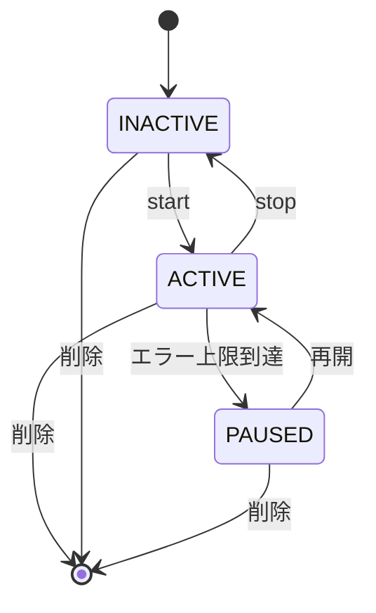
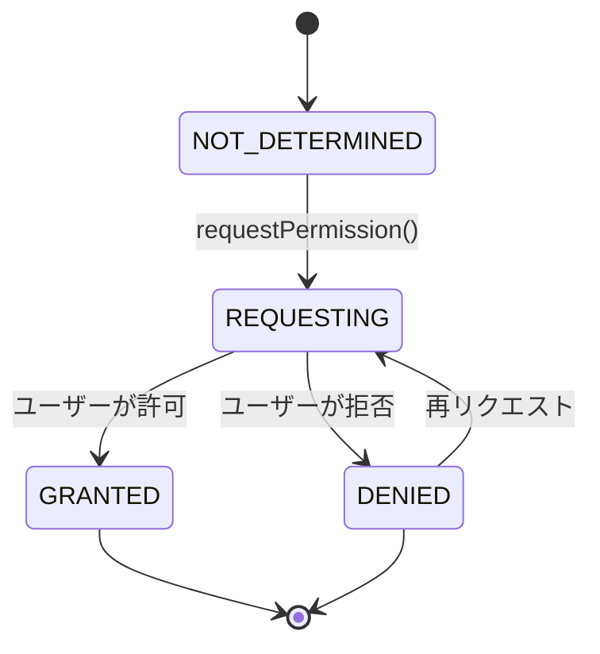

# 状態機械

システム内の主要エンティティの状態遷移を定義する。

## タスク状態

タスクのライフサイクル全体を管理する状態機械。



### 状態定義

| 状態     | 説明                                 | 遷移可能な状態              |
| -------- | ------------------------------------ | --------------------------- |
| TODO     | 未着手（初期状態）                   | DOING, DONE, ARCHIVED       |
| DOING    | 作業中                               | PAUSED, DONE, ARCHIVED      |
| PAUSED   | 一時停止                             | DOING, ARCHIVED             |
| DONE     | 完了                                 | ARCHIVED                    |
| ARCHIVED | アーカイブ済み（論理削除、終了状態） | -                           |

### 遷移トリガー

- **開始**: ユーザーがタスクを開始（TODO → DOING）
- **一時停止**: 作業を中断（DOING → PAUSED）
- **再開**: 中断したタスクを再開（PAUSED → DOING）
- **完了**: タスクを完了（TODO/DOING → DONE）
- **アーカイブ**: タスクをアーカイブ（任意の状態 → ARCHIVED）

### ビジネスルール

- `DOING` 状態のタスクは1つまで（推奨）
- `DONE` から `TODO` への戻しは不可
- `ARCHIVED` からの復帰は管理画面から手動で可能

## 目標状態

目標の進捗管理に使用する状態機械。



### 状態定義

| 状態   | 説明                     | 遷移可能な状態 |
| ------ | ------------------------ | -------------- |
| ACTIVE | 進行中（初期状態）       | PAUSED, DONE   |
| PAUSED | 一時停止                 | ACTIVE         |
| DONE   | 達成（終了状態）         | -              |

### 遷移トリガー

- **一時停止**: 目標を一時的に保留（ACTIVE → PAUSED）
- **再開**: 保留した目標を再開（PAUSED → ACTIVE）
- **達成**: 目標を達成（ACTIVE → DONE）

### ビジネスルール

- `DONE` の目標は編集不可（参照のみ）
- 関連タスクの完了率が100%でも自動的に `DONE` にはならない（手動で設定）
- `PAUSED` の目標に紐づくタスクは作成可能だが警告を表示

## キャプチャ要求

単発のキャプチャリクエストの状態を管理する。



### 状態定義

| 状態      | 説明                     | 遷移可能な状態     |
| --------- | ------------------------ | ------------------ |
| REQUESTED | リクエスト受付           | GRANTED, DENIED    |
| GRANTED   | 権限許可済み             | COMPLETED, FAILED  |
| DENIED    | 権限拒否（終了状態）     | -                  |
| COMPLETED | 実行成功（終了状態）     | -                  |
| FAILED    | 実行失敗（終了状態）     | -                  |

### 遷移トリガー

- **権限確認**: OS の権限状態を確認（REQUESTED → GRANTED/DENIED）
- **実行**: キャプチャを実行（GRANTED → COMPLETED/FAILED）

### エラーハンドリング

- `FAILED` の場合、エラーコードとメッセージをログに記録
- UI ではリトライボタンを表示（新規 REQUESTED として再実行）

## 定期キャプチャスケジュール

定期実行スケジューラの状態を管理する。



### 状態定義

| 状態     | 説明                             | 遷移可能な状態       |
| -------- | -------------------------------- | -------------------- |
| INACTIVE | 停止中（初期状態）               | ACTIVE               |
| ACTIVE   | 実行中                           | INACTIVE, PAUSED     |
| PAUSED   | 一時停止（エラー多発時の自動停止）| ACTIVE               |

### 遷移トリガー

- **start**: スケジュールを開始（INACTIVE → ACTIVE）
- **stop**: スケジュールを停止（ACTIVE → INACTIVE）
- **エラー上限**: 連続エラーが閾値を超えた（ACTIVE → PAUSED）
- **再開**: 手動で再開（PAUSED → ACTIVE）
- **削除**: スケジュール削除（任意の状態 → 終了）

### ビジネスルール

- `ACTIVE` 中は設定変更不可（一度 `stop` してから変更）
- 連続失敗が5回を超えると自動的に `PAUSED` へ遷移
- `PAUSED` 状態では通知を表示し、ユーザーに権限確認を促す

## 権限状態（OS レベル）

各プラットフォームの権限状態を抽象化。



### 状態定義

| 状態            | 説明                       | 遷移可能な状態      |
| --------------- | -------------------------- | ------------------- |
| NOT_DETERMINED  | 未確認（初回起動時）       | REQUESTING          |
| REQUESTING      | 権限リクエスト中           | GRANTED, DENIED     |
| GRANTED         | 許可済み（終了状態）       | -                   |
| DENIED          | 拒否済み                   | REQUESTING          |

### プラットフォーム別挙動

- **macOS**: `DENIED` から `REQUESTING` への遷移は、システム設定変更後のみ有効
- **Windows**: `NOT_DETERMINED` → 即 `GRANTED`（UAC不要）
- **Linux (Wayland)**: 毎回 `REQUESTING` → `GRANTED`（セッションごとに確認）
- **iOS**: `DENIED` の場合、設定アプリへの誘導が必須

## 状態遷移のロギング

全ての状態遷移は以下の情報と共にログに記録される：

- エンティティID（Task ID, Goal ID 等）
- 遷移前状態
- 遷移後状態
- トリガー（ユーザーアクション/システムイベント）
- タイムスタンプ
- 追加メタデータ（エラーコード等）

```json
{
  "entity": "task",
  "entityId": "task-123",
  "from": "TODO",
  "to": "DOING",
  "trigger": "user_action",
  "timestamp": "2025-10-29T10:30:00Z",
  "metadata": {}
}
```

この情報は将来的な分析やデバッグに活用される。

