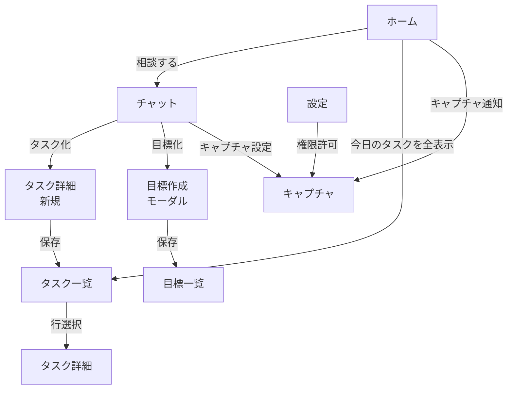

# UI設計

## 目標とタスクの定義（明確化）

### 目標 (Goal)

- 時間軸で **中長期**の成果を示す"到達点"
- KPI/評価指標を持つ（例: 「週の集中作業時間を合計10時間」）
- ステータスは `active/paused/done`。**直接の実行単位ではない**

### タスク (Task)

- 目標を実現するための **具体的な実行単位**（粒度: 15分〜数時間）
- 期日・見積・優先度・状態（todo/doing/paused/done）を持つ
- 1つの目標に0..N個ぶら下がる

### 関係性

- **Goal は Why/What、Task は How/When**
- チャットでは、曖昧な要求→Goal候補、直近の行動→Task候補として抽出

## 画面一覧

### 1. ホーム/今日 (`/`)

- 今日の目標サマリ、進捗、直近タスク、最近のキャプチャ通知、チャット起点 CTA

### 2. チャット (`/chat`)

- LLM との会話、タスク/目標の自動抽出・提案、クイックアクション（タスク化、期日付与、キャプチャ設定）

### 3. 目標（Goals） (`/goals`)

- 目標一覧・作成・編集。SMART テンプレ支援

### 4. タスク（Tasks） (`/tasks`)

- タスク一覧（フィルタ：今日/今週/未着手/完了）

### 5. タスク詳細 (`/tasks/:id`)

- 説明、期日、所要時間、優先度、関連目標、ステータス

### 6. キャプチャ (`/capture`)

- 定期キャプチャモードの起動/停止、インターバル設定（例: 1/5/10/15 分）、除外アプリ/時間帯、保存上限（ローテーション）、CPU/バッテリ配慮の **ジッター** 追加オプション
- キャプチャ通知の履歴表示
- 権限未許可時は権限ガイドと「許可をリクエスト」

### 7. 設定（ローカル） (`/settings/local`)

- ストレージパス、キャプチャ保存先、権限状態、デバッグログトグル

### 8. モーダル/ダイアログ

- 新規目標、タスク作成、権限要求、ショートカット一覧

## 画面遷移



## 各画面詳細

### ホーム/今日（/）

- **要素**: 今日の目標カード、今日のタスクリスト（チェック可能）、進捗リング、最近のキャプチャ通知 3 件、CTA（チャット / キャプチャ設定 / 新規タスク）
- **イベント**: チェック＝完了、ドラッグで優先度変更、長押しでクイック編集
- **遷移**: チャット、タスク一覧、キャプチャ

### チャット（/chat）

- **要素**: メッセージリスト、入力欄、送信、音声入力（任意）、ツールパレット：
  - 「タスク化」「目標化」「期日提案」「キャプチャ設定」
- **LLM アクション**: システムプロンプトによりエンティティ抽出（Goal/Task）と提案を返却
- **遷移**: タスク詳細(新規)/目標作成モーダル/キャプチャ/設定（ローカル）

### 目標（/goals）

- **要素**: 目標カード（タイトル、期間、KPI、進捗）、フィルタ（進行中/完了）
- **作成**: SMART テンプレ（S/M/A/R/T 入力）→ 保存
- **遷移**: タスク一覧（該当目標でフィルタ）

### タスク一覧（/tasks）

- **要素**: フィルタバー、並び替え、クイック追加、バルク操作（完了/期日変更）
- **遷移**: タスク詳細

### タスク詳細（/tasks/:id）

- **フィールド**: タイトル、説明、期日、推定所要、優先度、状態（後述の状態機械）、関連目標、タグ、添付（キャプチャ参照）
- **アクション**: 開始/中断/完了、チャットに送る

### キャプチャ（/capture）

- **機能**: 定期キャプチャモードの起動/停止のみ
- **設定項目**: インターバル（例: 1/5/10/15 分）、除外アプリ/時間帯、保存上限（ローテーション）、CPU/バッテリ配慮の **ジッター** 追加オプション
- **通知履歴**: キャプチャが実行された時刻の通知一覧を表示
- **権限**: 未許可時は権限ガイドと「許可をリクエスト」

### 設定（/settings/local）

- **項目**: 保存先、サムネイル解像度、キャプチャ既定形式（png/jpg）、ショートカット、権限状態、デバッグログ出力

## WebView 共通 UI & ナビゲーション

- **共通ヘッダ**: 現在日付、検索、グローバルメニュー
- **タブ/ドロワ**: ホーム / チャット / タスク / 目標 / キャプチャ / 設定
- **遷移規約**: SPA のルータ（`pushState`）。モーダルは `#/modal/<name>` を付与

## 画面遷移表（サマリ）

| From  | Action    | To              |
| ----- | --------- | --------------- |
| ホーム   | 相談する      | チャット            |
| チャット  | タスク化      | タスク詳細（新規）       |
| チャット  | 目標化       | 目標作成モーダル → 目標一覧 |
| チャット  | キャプチャ設定   | キャプチャ           |
| タスク一覧 | 行選択       | タスク詳細           |
| ホーム   | キャプチャ通知   | キャプチャ           |
| 設定    | 権限許可      | キャプチャ           |

## 簡易ワイヤーフレーム（テキスト）

```
[ヘッダ]  今日|検索|メニュー
[ホーム]
  (進捗リング) (今日の目標)
  [今日のタスク]
   - [ ] タスクA  … 期日
   - [ ] タスクB  … 期日
  [相談する] [新規タスク] [キャプチャ設定]
```

## 共通コンポーネント

- `ProgressRing` - 進捗表示リング
- `TaskList` - タスク一覧コンポーネント
- `GoalCard` - 目標カード
- `CaptureNotificationList` - キャプチャ通知リスト
- `Modal` - モーダルダイアログ
- `Toast` - トースト通知
- `EmptyState` - 空状態表示

### ショートカット例

- `Cmd/Ctrl+K`: コマンドパレット

## バリデーション/エラー UX

- 期日 < 今日 → 警告
- キャプチャ失敗（`FAILED`）→ リトライボタン + ログのコピー
- ブリッジ未初期化 → ページリロード案内

