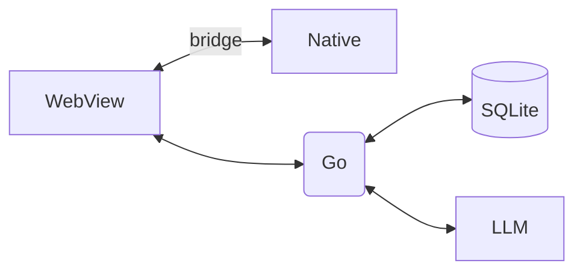
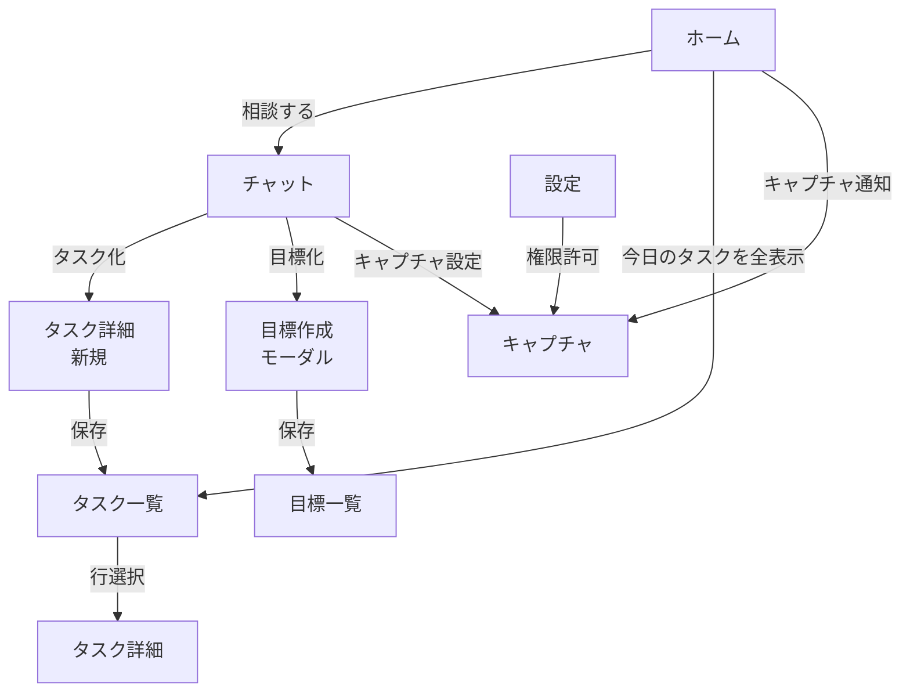
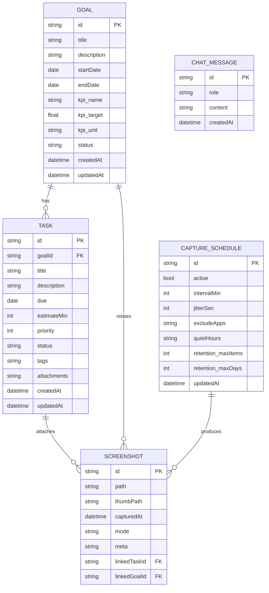
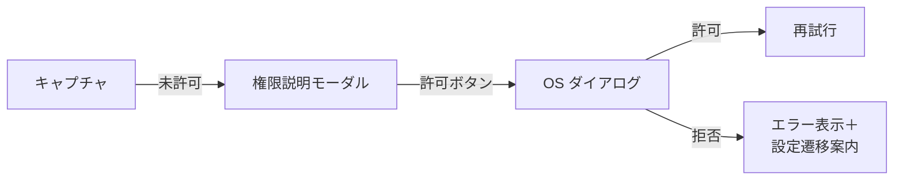
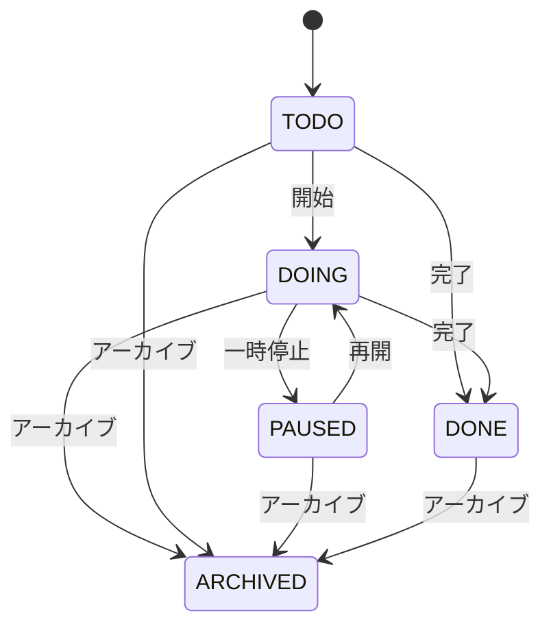
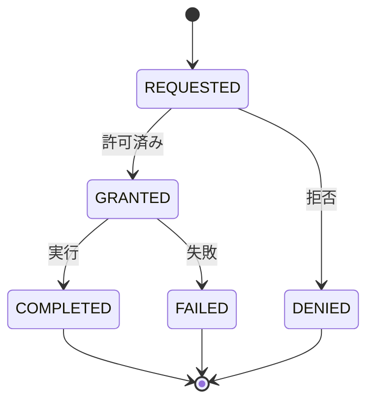
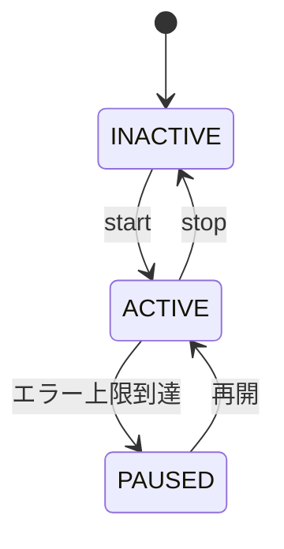

# LLM時間管理ツール設計書

- v1.0.0

## 1. 目的・前提

* **目的**: 各クライアントデバイス（モバイル/デスクトップ）から、LLMチャットを通じたタスク・目標設定とスクリーンショット取得（以降「キャプチャ」）を行い、ユーザーの時間管理を支援する。
* **前提**:

  * クライアントアプリは **WebView を共通 UI レイヤ**とし、ローカルサーバー（同一端末上、`http://localhost:<port>`）に接続する。
  * **個人用ローカルサーバープロトタイプ**。アカウント登録/ログイン/ヘルプは不要。
  * LLM 推論はローカルor LAN 上のエンジンを想定（外部連携は任意）。
  * 端末固有のキャプチャ許可/実行はネイティブブリッジ経由で行う（WebView ⇄ ネイティブ）。

---

## 2. 非機能要件（プロトタイプ）

* **起動時間**: 初回 3s 以内目標（WebView 初期ロード含む）。
* **オフライン**: 完全ローカルで動作。ネット断でも機能継続。
* **セキュリティ/プライバシ**: 端末内 SQLite/IndexedDB に保存。通信は `localhost` のみ。
* **ログ**: デバッグ用操作ログ（PII は不可）。
* **アクセシビリティ**: キーボード操作可能、コントラスト比 4.5:1 以上、ダイナミックタイプ対応。

---

## 3. アーキテクチャ概要

* **フロント（WebView）**: React + React Router。**SSG（静的サイト生成）**で全ルートをプリレンダし、起動時にローカルから配信しハイドレーション。ルーティングはクライアント側で完結。
* **ネイティブブリッジ**: `bridge.captureScreenshot()`, `bridge.getAppInfo()`, `bridge.requestPermission('capture')`。
* **ローカルサーバ（バックエンド）**: **Go** 製（例: net/http + chi / gin）。REST + WebSocket。データ永続化（SQLite）。
* **LLM サービス**: `/llm/chat`（ストリーム応答対応）。
* **クライアント技術スタック**:

  * **Linux (Ubuntu)**: ネイティブ層は **Rust**（screenshot/権限/トレイ/タイマー）。
  * **Windows**: **C++**（Win32/COM、Graphics Capture API）。
  * **iPad/iPhone**: **Swift**（ReplayKit / UIScreenCapture API）。
  * **Mac**: **Swift**（ScreenCaptureKit / AVFoundation）。



---

## 4. 画面一覧（情報設計）

### 4.0 目標とタスクの定義（明確化）

* **目標 (Goal)**

  * 時間軸で **中長期**の成果を示す“到達点”。
  * KPI/評価指標を持つ（例: 「週の集中作業時間を合計10時間」）。
  * ステータスは `active/paused/done`。**直接の実行単位ではない**。
* **タスク (Task)**

  * 目標を実現するための **具体的な実行単位**（粒度: 15分〜数時間）。
  * 期日・見積・優先度・状態（todo/doing/paused/done）を持つ。
  * 1つの目標に0..N個ぶら下がる。
* **関係性**

  * **Goal は Why/What、Task は How/When**。
  * チャットでは、曖昧な要求→Goal候補、直近の行動→Task候補として抽出。

1. **ホーム/今日** (`/`)

   * 今日の目標サマリ、進捗、直近タスク、最近のキャプチャ通知、チャット起点 CTA。
2. **チャット** (`/chat`)

   * LLM との会話、タスク/目標の自動抽出・提案、クイックアクション（タスク化、期日付与、キャプチャ設定）。
3. **目標（Goals）** (`/goals`)

   * 目標一覧・作成・編集。SMART テンプレ支援。
4. **タスク（Tasks）** (`/tasks`)

   * タスク一覧（フィルタ：今日/今週/未着手/完了）。
5. **タスク詳細** (`/tasks/:id`)

   * 説明、期日、所要時間、優先度、関連目標、ステータス。
6. **キャプチャ** (`/capture`)

   * 定期キャプチャモードの起動/停止、インターバル設定（例: 1/5/10/15 分）、除外アプリ/時間帯、保存上限（ローテーション）、CPU/バッテリ配慮の **ジッター** 追加オプション。
   * キャプチャ通知の履歴表示。
   * 権限未許可時は権限ガイドと「許可をリクエスト」。
7. **設定（ローカル）** (`/settings/local`)

   * ストレージパス、キャプチャ保存先、権限状態、デバッグログトグル。
8. **モーダル/ダイアログ**

   * 新規目標、タスク作成、権限要求、ショートカット一覧。

---

## 5. 画面遷移



---

## 6. 各画面詳細

### 6.1 ホーム/今日（/）

* **要素**: 今日の目標カード、今日のタスクリスト（チェック可能）、進捗リング、最近のキャプチャ通知 3 件、CTA（チャット / キャプチャ設定 / 新規タスク）。
* **イベント**: チェック＝完了、ドラッグで優先度変更、長押しでクイック編集。
* **遷移**: チャット、タスク一覧、キャプチャ。

### 6.2 チャット（/chat）

* **要素**: メッセージリスト、入力欄、送信、音声入力（任意）、ツールパレット：

  * 「タスク化」「目標化」「期日提案」「キャプチャ設定」。
* **LLM アクション**: システムプロンプトによりエンティティ抽出（Goal/Task）と提案を返却。
* **遷移**: タスク詳細(新規)/目標作成モーダル/キャプチャ/設定（ローカル）。

### 6.3 目標（/goals）

* **要素**: 目標カード（タイトル、期間、KPI、進捗）、フィルタ（進行中/完了）。
* **作成**: SMART テンプレ（S/M/A/R/T 入力）→ 保存。
* **遷移**: タスク一覧（該当目標でフィルタ）。

### 6.4 タスク一覧（/tasks）

* **要素**: フィルタバー、並び替え、クイック追加、バルク操作（完了/期日変更）。
* **遷移**: タスク詳細。

### 6.5 タスク詳細（/tasks/:id）

* **フィールド**: タイトル、説明、期日、推定所要、優先度、状態（後述の状態機械）、関連目標、タグ、添付（キャプチャ参照）。
* **アクション**: 開始/中断/完了、チャットに送る。

### 6.6 キャプチャ（/capture）

* **機能**: 定期キャプチャモードの起動/停止のみ。
* **設定項目**: インターバル（例: 1/5/10/15 分）、除外アプリ/時間帯、保存上限（ローテーション）、CPU/バッテリ配慮の **ジッター** 追加オプション。
* **通知履歴**: キャプチャが実行された時刻の通知一覧を表示。
* **権限**: 未許可時は権限ガイドと「許可をリクエスト」。

### 6.7 設定（/settings/local）

* **項目**: 保存先、サムネイル解像度、キャプチャ既定形式（png/jpg）、ショートカット、権限状態、デバッグログ出力。

---

## 7. WebView 共通 UI & ナビゲーション

* **共通ヘッダ**: 現在日付、検索、グローバルメニュー。
* **タブ/ドロワ**: ホーム / チャット / タスク / 目標 / キャプチャ / 設定。
* **遷移規約**: SPA のルータ（`pushState`）。モーダルは `#/modal/<name>` を付与。

---

## 8. データモデル（概略）

（下記 ER 図参照。詳細は型定義を併記）

```ts
// 主要テーブル: goals, tasks, screenshots(内部), capture_schedules, chat_messages
```

---

## 8.1 ER 図（概略）



## 9. API（ローカルサーバ）

* **LLM**

  * `POST /llm/chat` → SSE/WS ストリーム。`{messages:[...]}`
* **タスク**

  * `GET /tasks?status=&due=` / `POST /tasks` / `GET /tasks/:id` / `PATCH /tasks/:id` / `DELETE /tasks/:id`
* **目標**

  * `GET /goals` / `POST /goals` / `PATCH /goals/:id`
* **キャプチャ**

  * `GET /screenshots` / `GET /screenshots/:id`（画像ファイル配信）
  * **定期キャプチャ**:

    * `GET /capture/schedule` → 現行設定取得（`CaptureSchedule`）
    * `PUT /capture/schedule` → 作成/更新
    * `POST /capture/schedule/start` → 有効化
    * `POST /capture/schedule/stop` → 停止
* **設定**

  * `GET /settings` / `PATCH /settings`

**エラーパターン**（例）

```json
{ "code": "PERMISSION_DENIED", "message": "Screen capture not allowed" }
{ "code": "BRIDGE_UNAVAILABLE", "message": "Native bridge not initialized" }
```

---

## 10. 主要フロー（シーケンス）

### 10.1 チャットからタスク作成

1. User→Chat: 「来週水曜にレポート草案を…」
2. LLM→Front: 構造化提案 `{task:{title,due,estimate}}`。
3. Front: タスク作成モーダルを起動（編集可）。
4. API: `POST /tasks` → 保存 → 画面遷移 `/tasks/:id`。

### 10.2 定期キャプチャの開始/停止

1. User→Capture: 「5分おきに実行」→ `PUT /capture/schedule {intervalMin:5, active:true}`
2. Server: スケジューラ起動（Go でタイマー）。
3. Server→NativeBridge: 間隔ごとに `captureScreenshot()`。
4. User→Capture: 「停止」→ `POST /capture/schedule/stop`。

### 10.3 目標→タスク化

1. `/goals` で目標選択→「タスクを追加」。
2. `POST /tasks` goalId 指定。
3. タスク一覧で目標フィルタを自動適用。

---

## 11. 権限・OS 依存挙動

* **macOS (Swift)**: 画面収録権限が未許可→システム設定誘導。許可後アプリ再起動要求の可能性。ScreenCaptureKit 利用。
* **Windows (C++)**: Graphics Capture API。UAC 権限不要だが複数モニタ選択 UI 必要。
* **Linux/Ubuntu (Rust)**: X11/Wayland 両対応。Wayland はポータル(API)経由を優先、領域選択 UI をRustで実装。
* **iOS/iPadOS (Swift)**: OS 制約上の全画面キャプチャは制限。アプリ外はシステム録画/共有拡張を併用。アプリ内ビュー限定キャプチャを標準。

**権限取得フロー**



---

## 12. 状態機械

### 12.1 タスク状態



### 12.2 キャプチャ要求



### 12.3 定期キャプチャ（スケジュール）



---

## 13. ルーティング/URL 設計（WebView 内 SPA）
- `/` ホーム
- `/chat`
- `/goals`
- `/tasks` / `/tasks?filter=today|week|open`
- `/tasks/:id`
- `/capture`
- `/settings/local`
- モーダル: `?modal=new-task` / `?modal=new-goal`

**ディープリンク/スキーム**（ネイティブから起動）
- `mytime://capture`
- `mytime://task/<id>`

---

## 14. WebView-ネイティブブリッジ I/F

```ts
interface Bridge {
  captureScreenshot(params?: { mode?: 'full'|'window'|'region'; region?: {x:number;y:number;width:number;height:number} }): Promise<{ path: string; thumbPath?: string }>
  requestPermission(kind: 'capture'): Promise<'granted'|'denied'>
  getAppInfo(): Promise<{ platform: 'ios'|'android'|'mac'|'win'|'linux'; version: string }>
}
```

---

## 15. 共通コンポーネント（UI）

* `ProgressRing`、`TaskList`、`GoalCard`、`CaptureNotificationList`、`Modal`、`Toast`、`EmptyState`。
* ショートカット例: `Cmd/Ctrl+K`（コマンドパレット）。

---

## 16. バリデーション/エラー UX

* 期日 < 今日 → 警告。
* キャプチャ失敗（`FAILED`）→ リトライボタン + ログのコピー。
* ブリッジ未初期化 → ページリロード案内。

---

## 17. 記録/監査

* 主要イベント: タスク作成/更新、完了、キャプチャ実行、権限状態変化。
* 保持: ローカル 30 日（プロトタイプ）。

---

## 18. メトリクス（プロトタイプ）

* 1 日あたり作成タスク数、完了率、キャプチャ回数、チャットからのタスク化比率。

---

## 19. テスト観点（抜粋）

* 権限未許可時のキャプチャ動作。
* WebSocket 切断時のチャット再接続。
* 定期キャプチャのインターバル精度とジッター動作。
* 大量キャプチャ通知の一覧パフォーマンス。

---

## 20. 将来拡張

* 外部カレンダー連携（読み取りのみ）。
* 音声要約→タスク化。
* 目標の自動進捗推定（キャプチャ/完了イベントから）。
* エクスポート（Markdown/CSV）。

---

## 21. 画面遷移表（サマリ）

| From  | Action    | To              |
| ----- | --------- | --------------- |
| ホーム   | 相談する      | チャット            |
| チャット  | タスク化      | タスク詳細（新規）       |
| チャット  | 目標化       | 目標作成モーダル → 目標一覧 |
| チャット  | キャプチャ設定   | キャプチャ           |
| タスク一覧 | 行選択       | タスク詳細           |
| ホーム   | キャプチャ通知   | キャプチャ           |
| 設定    | 権限許可      | キャプチャ           |

---

## 22. 簡易ワイヤーフレーム（テキスト）

```
[ヘッダ]  今日|検索|メニュー
[ホーム]
  (進捗リング) (今日の目標)
  [今日のタスク]
   - [ ] タスクA  … 期日
   - [ ] タスクB  … 期日
  [相談する] [新規タスク] [キャプチャ設定]
```

---

## 23. 実装メモ

* SPA ルータ、状態管理（Redux/Pinia/Zustand 等）、SSE/WS ストリーム対応。
* 画像保存は OS 推奨ディレクトリ（ユーザー指定可）。
* LLM からの提案 JSON はスキーマバリデーション（Zod 等）。

---

## 24. リポジトリ/ディレクトリ構成（概要）

### 24.1 モノレポ推奨

```
repo/
  server/                # Go バックエンド
    cmd/api/            # main パッケージ
    internal/
      http/             # ルータ/ハンドラ（chi/gin）
      ws/               # WebSocket/SSE
      store/            # SQLite アクセス（sqlc/gorm）
      capture/          # Bridge 呼び出し・スケジューラ
      llm/              # LLM クライアント
      config/
      logging/
    migrations/         # DB マイグレーション
    go.mod go.sum

  web/                  # React + React Router (SSG)
    src/
      routes/           # /, /chat, /goals, /tasks, /capture, /settings/local
      components/
      lib/
      styles/
    public/
    package.json
    vite.config.ts      # or Next.js の静的輸出

  clients/
    linux-rust/
      src/              # Wayland/X11 キャプチャ、bridge 実装
      Cargo.toml
    windows-cpp/
      src/              # Graphics Capture API、bridge DLL/EXE
      CMakeLists.txt
    ios-swift/
      App/              # WebView + Bridge（WKScriptMessageHandler）
      Shared/
      Package.swift
    macos-swift/
      App/              # ScreenCaptureKit + WebView
      Shared/
      Package.swift

  shared/
    schemas/            # Zod/JSON Schema（Task/Goal 等）
    ui/                 # 共通デザイン/アイコン

  tools/
    scripts/            # 開発用スクリプト

  README.md
```

### 24.2 デプロイ/配布（ローカル専用）

* **server**: 単体バイナリ（Go）
* **web**: `web/dist` を server の静的配信へ同梱
* **clients**: 各 OS 向けバンドル（Deb/DMG/EXE/TestFlight 等）
